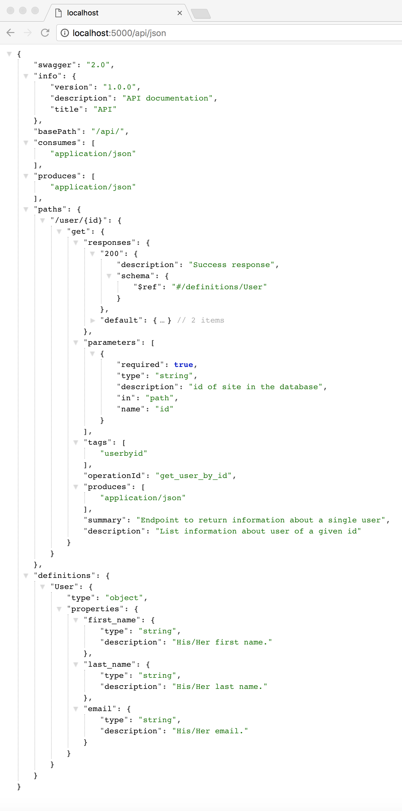

# Flask-DSwagger

[](https://travis-ci.org/abassel/Flask-DSwagger)
[](https://coveralls.io/github/abassel/Flask-DSwagger?branch=master)
[](https://badge.fury.io/py/Flask-DSwagger)
[](https://pypi.python.org/pypi/Flask-DSwagger)


Provides ability to converge all OpenAPI 2.0 Doc String documentation in flask endpoints to a single, unified endpoint where it can be consumed by any OpenAPI 2.0 compatible client


[OpenAPI 2.0](https://github.com/OAI/OpenAPI-Specification/blob/master/versions/2.0.md) is a standard to describe an API interface.

[Flask](http://flask.pocoo.org) is a microframework for Python based on Werkzeug, Jinja 2 and good intentions.

[Mongoengine](https://github.com/MongoEngine/mongoengine) is an ORM-like layer on top of PyMongo.


## Install

```bash
pip install Flask-DSwagger
```

## Example

In the example bellow, Flask-DSwagger will generate automatically an OpenAPI 2.0 spec endpoint:

```python

from flask import Flask
import mongoengine as mongo

import Flask_DSwagger as fds

app = Flask(__name__)

class User(mongo.Document, fds.model_docString):
    """
    type: object
    properties:
      first_name:
        type: string
        description: His/Her first name.
      last_name:
        type: string
        description: His/Her last name.
      email:
        type: string
        description: His/Her email.
    """
    first_name = mongo.StringField()
    last_name = mongo.StringField()
    email = mongo.StringField()


@app.route('/')
def hello():
    return "I will not be in the documentation because my path does not start with /api"


@app.route('/api/user/<id>')
def user_getbyname(id):
    """
    "/user/{id}":   # Must start with forward slash
        get:

            summary: "Endpoint to return information about a single user"

            description: "List information about user of a given id"

            tags: ["userbyid"]

            operationId: "get_user_by_id"

            produces:
                - "application/json"

            parameters:
            - name: id
              in: path
              description: "id of site in the database"
              required: true
              type: "string"

            responses:
              "200":
                description: "Success response"
                schema:
                  $ref: "#/definitions/User"
              default:
                description: "unexpected error"
                schema:
                  $ref: "#/definitions/ErrorModel"

    """

    return "Hello {}!".format(id)


api_swag = fds.api_swagger_register(app)

api_swag.generate(db_models={"User": User})

if __name__ == '__main__':
    app.run()

```

### Expected output:

Go and visit /api/json to see the spec. Point any OpenAPI 2.0 client to that url to get access to the API:




## References :notebook:
- [OpenAPI 2.0](https://github.com/OAI/OpenAPI-Specification/blob/master/versions/2.0.md)
- [Flask](http://flask.pocoo.org)
- [Mongoengine](https://github.com/MongoEngine/mongoengine)
